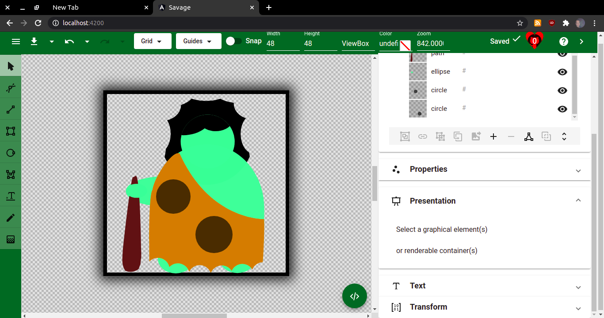

# Savage

Welcome to Savage, a different kind of vector graphics editor.
You can try it out at [savageapp.ml](https://savageapp.ml/).

I developed this app over a couple of months while having excess free time due to being between jobs and dealing with Covid-19.

I figured this would be a good showcase of my front-end skills.
Another reason why I made this is that ever since I first started coding I've considered graphics editors the epitome of software development, it's what cool developers do :)

Yet another reason is that I kind of hate Inkscape. It's what I've been using for years, but the interface is ugly, clunky, and confusing. The SVGs it produces are a mess. Some edits are much easier to do by opening the SVG in a text editor, yet Inkscape SVGs a pretty difficult to edit manually. Hence with Savage, I aimed to produce SVGs that would be downright pleasant to edit manually. While Savage includes an interface for most SVG 2.0 standard features, it also includes a raw XML editing interface that shares undo/redo history with the rest of the app.

Savage forgoes the common graphics editor feature set to focus on vector editing. That means no calligraphic brush, for it's just a complex path and thus a low priority feature. Another thing Savage doesn't feature is layers. Instead, you have the elements panel where elements, groups, and everything else is represented in the document hierarchy.

Now I poured a lot of time into Savage development and bug fixing, however, it's still fairly buggy and I'm still working on it.
Part of the reason for this is that I'm fairly horrible at math.
If you see wrong calculations and know how to do it right, pull requests are very welcome.

## Features and Overview

- Vector editing. Savage only supports SVG format, but every vector editor can export to this format.
- Autosave and recent documents. When you open and edit a document in Savage, every change is saved to IndexedDB, so even if you run into a critical bug, you can just reload the page and continue where you left off from the recent menu.
- Multiple export formats. Savage provides downloads for Savage SVG which is an SVG with extra metadata, Optimized SVG - an SVG with everything not strictly necessary removed, roughly half in size, and PNG.

### The Toolbar

The Savage toolbar is located along the left edge of the screen. Here you can select from available tools and right-click to access tool options. Note, that not every tool has options.

- Object select/transform tool. The default tool that is selected when you open a document. Clicking an element selects it, dragging moves it, dragging empty space creates a selection rectangle. Clicking element again toggles between scale/rotate/skew modes. Shift-clicking selects multiple elements, control-clicking removes elements from selection, alt clicking selects container element if any. To move multiple elements hold shift while dragging. This tool has options. When apply matrix is on (default) transforming element tries to apply a transformation to coordinates rather than applying transform attribute.
- Path tool. The most complex and powerful tool available. You can only select `<path>` elements with it. Double-clicking when no element is selected creates a new path and selects it. Double-clicking when a path is selected appends a segment to a path. Shift double-clicking inserts a segment between nearest segments. The rectangular handles move segments, the round handles adjust curves. Clicking and dragging create a selection rectangle for segment handles.
- Line tool. You can only select `<line>` and `<polyline>` elements with it. Double-clicking starts the creation of a new line. Double-clicking again sets the end point in line mode and the next segment in polyline mode. You can toggle between modes in tool options.
- Rectangle tool. You can only select `<rect>` elements with it. Clicking and dragging create a rectangle. Hold control to draw a square. Rhombus handle moves element. Square handles scale element. Round handles set corner radius.
- Circle tool. You can only select `<circle>`, `<ellipse>`, and unmodified `<path>` arc elements. Drag to draw an ellipse. Hold control to draw a circle. Hold shift to draw an arc. Rhombus handle moves element. Round handles set radius and arc length.
- Polygon tool. You can only select `<polygon>` elements with it. This tool has options. You can toggle between regular and freehand drawing modes, as well as set the number of sides for a regular polygon. In regular polygon mode drag to draw a polygon. Hold control to draw a star. Rhombus handle moves element. Round handle(s) adjust the radius.
In freehand mode double click to set a point. Hold shift to insert point between nearest points. Drag to draw a selection rectangle. Hold shift to move multiple points. Control-click to deselect point.
- Text tool. You can only select `<text>` elements with it. Edits to text content are reflected on canvas live.
Setting a path converts `<tspan>` to `<textPath>`. Click empty space to create new `<text>` element.
- Shape tool. Draw complex shapes with configurable parameters, such as spirals or arrows. Also supports basic 3D shapes.
- Stamp tool. Draw predefined shapes. You can search and select a library of 5000+ icons to quickly insert them into your drawing.
- Freehand tool. A simple brush to draw freehand shapes. In the options, you can configure how much the resulting path is simplified as well as smoothed.
- Gradient tool. Click on shape and drag to set its' fill/stroke to a gradient. You can choose between radial gradient and linear gradient in the options. Adding more stops can be done in the elements panel. Setting stop color can be done in the properties panel.
- Eye-dropper tool. Pick colors from canvas. Note that if the object is off-canvas Eye-dropper tool won't work correctly.
- Measure tool. Draw a rectangle to measure its' position on canvas as well as the diagonal distance between its' corners.

### Sidebar panels

- Elements panel. Here you can see the hierarchy of the document. `<defs>` and `<symbol>` elements are moved to the definitions tab for better organization. Various options are available through right-click and the bottom toolbar.
Hotkeys are supported, such as page up/down to reorder elements, delete to remove an element, and control D to duplicate an element. To create a specialty container (`<mask>`, `<clipPath>`, `<pattern>`, ...) select a shape or group, and move it to a container via the toolbar or right-click menu. Every shape and text can be converted to a path. Boolean operations can be applied to 2 paths.
- Properties panel. All attributes that don't fit elsewhere can be live edited here.
- Presentation panel. All presentation attributes, such as fill and stroke, can be edited here.
- Text panel. Attributes that apply to textual elements can be edited here. This includes font options and more.
Note that all of Google fonts are available here but it can take up to 10 minutes to load them all on first load.
So if changing font family doesn't change the text on canvas give it more time and try again.
- Transform panel. Savage uses matrices internally to apply all transforms. Here you can edit a matrix directly or decompose it, edit the functions individually and recompose it to apply it.

### Raw editing sheet

Savage uses the Monaco editor component to provide XML editing. Because of this editing is similar to editing XML in Visual Studio Code. Upon clicking Save or pressing Control-S changes are applied to canvas and saved in an undo history.

## Building

Savage is a fairly standard Angular app. To run it locally, clone this repo and run `npm start` from the project directory. Savage is available on the default port: `localhost:4200`.
